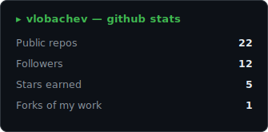
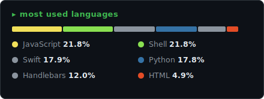

<div align="center">



<p>
  <a href="https://www.linkedin.com/in/vitalylobachev"></a>
  <a href="https://github.com/vlobachev"></a>
  
</p>

</div>

Building fault-tolerant, self-healing infrastructure on **AWS** and **Kubernetes**. Fifteen-plus years across cloud, IaC, CI/CD and observability — now building **AI platforms**: production Kubernetes for GenAI workloads, LLMOps pipelines and agentic tooling.


### `▸` Focus

```text
cloud/k8s      →  highly-available, multi-account AWS · EKS · service mesh
infra-as-code  →  Terraform · Ansible · reproducible environments
gitops         →  ArgoCD · Argo Rollouts (blue-green, canary)
observability  →  Prometheus · Grafana · Thanos · unified logging + alerting
ai platform    →  GenAI on EKS · Dify · Onyx · RAG · vector databases
ai agents (now)→  Claude Code · MCP servers · LiteLLM · multi-agent workflows
```

### `▸` Stack

| Domain | Tooling |
| --- | --- |
| **Cloud & Orchestration** | `AWS` `Kubernetes` `EKS` `Helm` `Istio` `Docker` `Containerd` |
| **IaC & Automation** | `Terraform` `Ansible` `Packer` `CloudFormation` |
| **CI/CD & GitOps** | `ArgoCD` `Argo Rollouts` `Flux` `GitHub Actions` `Jenkins` `GitLab CI` |
| **Observability** | `Prometheus` `Grafana` `Thanos` `ELK` `Jaeger` `PagerDuty` |
| **AI / LLMOps** | `Claude Code` `MCP` `LiteLLM` `Dify` `Onyx` `Karpenter` `vector DBs` |
| **Data & Security** | `PostgreSQL` `MongoDB` `Redis` `Snowflake` `HashiCorp Vault` `AWS KMS` |


### `▸` Deployment log — experience

| When | Role | Shipped |
| --- | --- | --- |
| **now** | Platform Engineer · **Studytube** | Production **EKS platform for GenAI workloads** — Karpenter node autoscaling, ArgoCD GitOps, Gateway API, External Secrets, IRSA/KMS security baseline; runs LLM apps (Dify, Onyx) and RAG pipelines end-to-end |
| **2024 → 2025** | Platform Engineer · **Bitvavo** | HA AWS + Kubernetes for crypto infra; automated **50+ blockchain wallet nodes** with Terraform + ArgoCD; progressive delivery via Argo Rollouts; **99.9% uptime** with automated recovery |
| **2022 → 2024** | Senior DevOps · **DataArt** | Multi-account AWS with Control Tower; migrated legacy services to Kubernetes + Istio; unified Prometheus/Grafana/Thanos observability; **deploy time −75%** |
| **2020 → 2022** | Project Lead & DevOps · **Samson-opt / Rework** | Led infrastructure automation; established Terraform + Ansible IaC; centralized logging & monitoring |
| **2015 → 2020** | Full-Stack → DevOps Engineer | Moved from application development into infrastructure; built CI/CD across diverse stacks |

<sub>Full history on **[LinkedIn](https://www.linkedin.com/in/vitalylobachev)**.</sub>

### `▸` Selected work

- **GenAI Platform on EKS** — production Kubernetes platform for AI workloads: Karpenter autoscaling, ArgoCD GitOps, Gateway API, External Secrets; hosting Dify, Onyx and RAG pipelines with full IaC (Terraform).
- **Agentic Engineering Setup** — multi-agent development workflows on Claude Code: custom MCP servers, shared knowledge-graph memory (Graphiti/Cognee), LiteLLM gateway, autonomous CI-verified delivery.
- **LLM Infrastructure Automation** — automated 50+ wallet-node deployments, integrated MongoDB Atlas with Snowflake, built LLM-specific CI/CD pipelines.
- **Kubernetes + Istio Migration** — modernized legacy infra onto multi-account AWS with a service mesh and GitOps-driven progressive delivery.
- **Unified Observability Platform** — centralized Prometheus + Thanos with Grafana dashboards and automated PagerDuty alerting; **MTTD −80%**.
- **Security-First Architecture** — Vault-managed secrets, KMS encryption everywhere, self-healing HAProxy with liveness probes.


### `▸` Signals

<div align="center">




</div>

### `▸` Elsewhere

- **[DevOps Best Practices](https://github.com/devops-best-practices)** — infrastructure patterns & reference automation
- **[AI Technologies](https://github.com/best-aI-technologies)** — LLMOps and AI-infra experiments
- **[LinkedIn](https://www.linkedin.com/in/vitalylobachev)** — full professional history

<div align="center">
<sub><code>$ echo "open to interesting infrastructure & AI-ops challenges"</code></sub>
</div>
